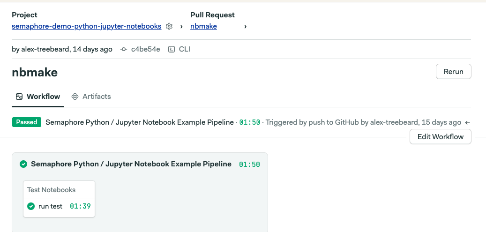

# A Semaphore demo CI/CD pipeline using pytest and nbmake

This repo shows how you can automatially test Jupyter Notebooks.

  
   
  The pipeline defined in this repo, running for a pull request.

